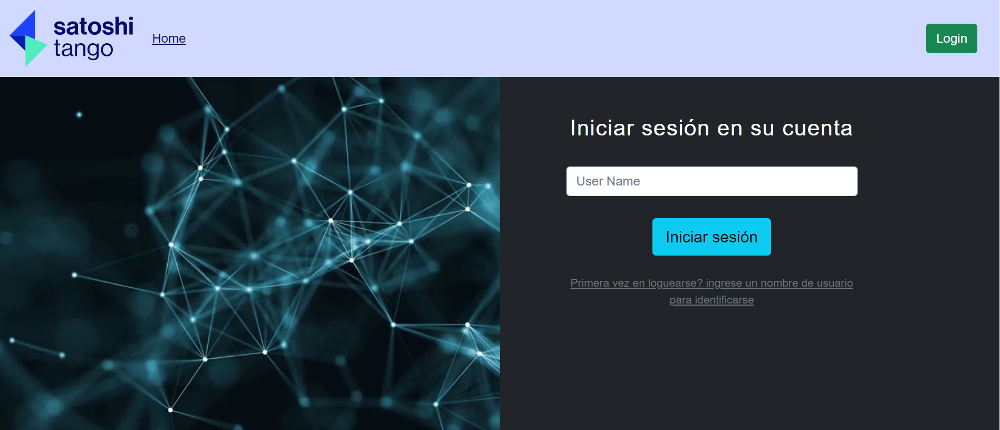
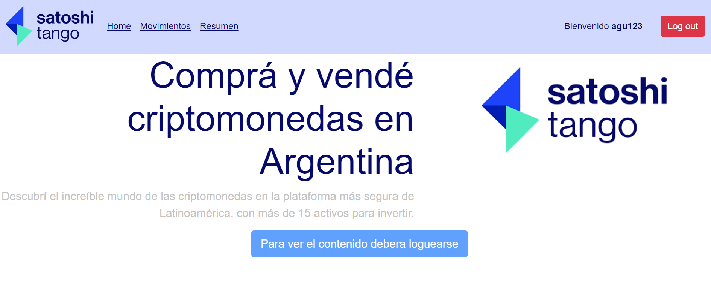

# Lab lll - Proyecto Final - Vue 3 CLI - Cryptocurrency Exchange

### [Assignment for the final project of the Computer Laboratory III course](https://docs.google.com/document/d/19ZKeSIIHnpYRTzKMfWqzJCE-F-JxYznScslNWIlZQYg/edit)

**Web page mounted for test code:**  https://vue-crypto-satoshi.netlify.app/
 
**User for test web:** agu123


### Views Example
| LOGIN | HOME     |
| :-------- | :------- |
| | |

Project created with previously defined packages when installing vue project as **Babel, Vuex** and **Router**

## Project setup
```
npm install
npm install vue
npm install axios
npm install --save apexcharts
npm install --save vue-apexcharts
npm install vue-loading-overlay@^6.0 
npm install -S vue-sweetalert2
```

### Compiles and hot-reloads for development
```
npm run serve
```

### Compiles and minifies for production
```
npm run build
```

### Customize configuration
See [Configuration Reference](https://cli.vuejs.org/config/).


### *Commands used for push code in* GitHub *repositore*
```
git remote add origin https://github.com/welschen99/LabIII-Vue-Finall.git
git branch -M main  
git push -u origin main
```
### Contributor
- [@Agustín Welschen](https://www.github.com/welschen99)
